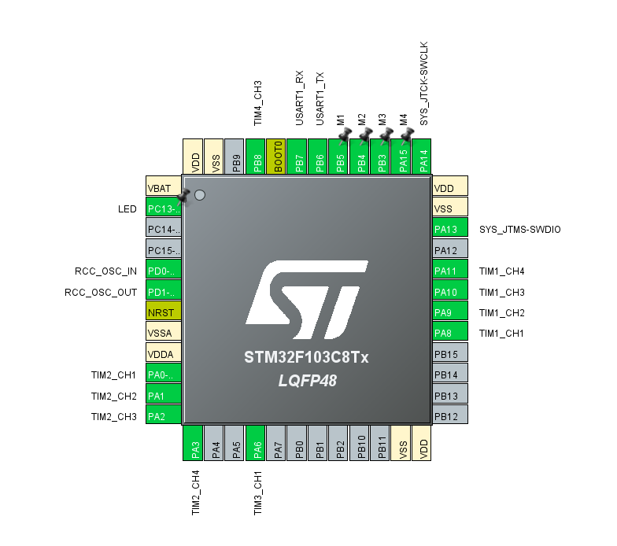

<h1>Декодер PPM</h1>

<h2>Вступ</h2>

Проєкт є простим декодером 8-канального PPM сигналу з виводом значень на ШІМ канали. Використовується процесор STM32F103C8T6. Код написано з використанням бібліотеки LL. Для ШІМ використані канали 1-4 таймерів 1 та 2. Передбачено 4 GPIO для керування H-мостами (можна масштабувати). Сигнал PPM може бути як отриманий по UART у цифровому вигляді, так і подаватися на вхід 1 каналу таймера 3 для декодування. Також передбачено функціонал для самотестування у вигляді відправки тестового пакета по UART (TX коротиться на RX) або генерацією PPM сигналу 3 каналом таймеру 4 (коротиться на вхід 1 каналу таймеру 3).
 

<h2>GPIO</h2>
</img>

<h2>Опис послідовного протоколу</h2>

<h3>Структура повідомлення</h3>
<pre lang=C>
typedef struct {
  uint8_t  sync1;
  uint8_t  sync2;
  uint16_t ch[CH_NUM];
  uint16_t checksum;
} __attribute__((packed)) pwm_data_t;
</pre>

<h3>Функція розрахування чексуми</h3>
<pre lang=C>
static uint16_t calc_checksum(uint8_t *pwm_data_ptr) {
  uint8_t a = 0, b = 0;
  uint16_t i = 0;
  /* len of data minus len of the checksum */
  for(i = 0; i < (sizeof(pwm_data_t) - sizeof(uint16_t) - 2); i++) {
    a += pwm_data_ptr[2 + i];  /* 2 - offset for sync symbols */
    b += a;
  }
  return (uint16_t)((b << 8) | a);
}
</pre>

<h2>PPM</h2>

PPM відповідає стандарту - 2мс на канал. Канали йдуть послідовно від 1 до 8. Все що довше 2.1 мс вважається маркером синхронізації. Детекція відбувається по наростаючому фронту.

